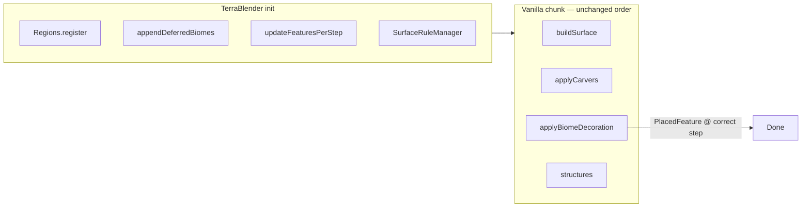

# Decoration systems audit — 2026-07-15

Доповнення до [`2026-07-15-worldgen-research.md`](2026-07-15-worldgen-research.md): **повна** система декорації в TerraBlender / Terralith / BOP / RU та порівняння з NewTerraForged, з висновками **що і як виправляти**.

---

## 1. Що таке «система декорації» (повний scope)

Декорація в 1.18.2 — це не один клас. Це ланцюг:

| Шар | Vanilla / TB-моди | NewTerraForged |
|-----|-------------------|----------------|
| **Biome registry** | Datapack JSON або code bootstrap | `BiomeMapManager` + TOML + registry scan |
| **Biome → features[]** | 10 `GenerationStep.Decoration` масивів | Те саме з biome JSON + **окремий** TF vegetation grid |
| **featuresPerStep** | TB mixin перебудовує кеш | Не використовується — власний `FeatureDecorator` |
| **Surface rules** | TB `NamespacedSurfaceRuleSource` | Vanilla overworld rules + `Surface.apply` post-pass |
| **Surface build** | `buildSurface` → `SurfaceSystem` | `SurfaceDecorator` → vanilla + cliff/snow |
| **Carvers** | `applyCarvers` до decor | AIR step + **deferred** block carve в decorate |
| **Feature placement** | `applyBiomeDecoration` по stages | `FeatureDecorator` + `PositionSampler` + cave backends |
| **Structures** | `StructureFeatureManager` | `VanillaDecorator.placeStructures` (пізніше в decorate) |
| **Biome quart storage** | Тільки з `createBiomes` | Carve paint, restorer, shore clip, decor |
| **Post-passes** | Майже немає | river fill, shore clip, cave decor, crust strip, integrity |

---

## 2. Reference mods — як працює декорація

### 2.1 TerraBlender (фундамент)

**Файли (GitHub `TB-1.18.2-1.x.x`):**

- `terrablender/api/Region.java`, `Regions.java`, `SurfaceRuleManager.java`
- `terrablender/mixin/MixinBiomeSource.java` — deferred biomes + `featuresPerStep`
- `terrablender/mixin/MixinMultiNoiseBiomeSource.java` — region-aware biome pick
- `terrablender/mixin/MixinNoiseGeneratorSettings.java` — namespaced surface
- `terrablender/worldgen/surface/NamespacedSurfaceRuleSource.java`
- `terrablender/util/LevelUtils.java` — init on `ServerAboutToStart`

**Ключова ідея:** TB **не декорує**. Він гарантує:

1. Mod biomes у `possibleBiomes`
2. `featuresPerStep` містить їх `PlacedFeature` для кожного stage
3. Surface rule вибирається по **namespace біому** (`terralith:`, `biomesoplenty:`, …)
4. Vanilla `NoiseBasedChunkGenerator` виконує **стандартний** порядок

```
ServerAboutToStart (TB)
  → appendDeferredBiomesList + updateFeaturesPerStep

Per chunk (vanilla):
  buildSurface     → NamespacedSurfaceRuleSource
  applyCarvers     → biome.carvers
  applyBiomeDecoration → for step 0..9: featuresPerStep[step]
  structures       → structure_set / template pools
```

**Deferred placeholder:** `terrablender:deferred_placeholder` — region може «пробити дірку» під vanilla climate tree (index 0).

### 2.2 Terralith

**Branch:** `1.18.2-mod`

| Підсистема | Реалізація |
|------------|------------|
| Biome placement | `TerralithRegion` + params з `data/minecraft/dimension/overworld.json` |
| Biome defs | Datapack `data/terralith/worldgen/biome/*.json` |
| Features | Datapack `configured_feature` + `placed_feature` |
| Surface | Один namespace rule з `overworld.json` noise settings → `SurfaceRuleManager.addSurfaceRules("terralith", …)` |
| Carvers | Biome JSON `carvers.air` (напр. deep ravine) |
| Cave decor | Placed features у `features[7,8]` — patches, mushrooms, noise_reducer |
| Chunk hooks | **Немає** на ChunkGenerator |
| Java features | Майже немає — все datapack |

**Приклад cave biome у репо:** `data/terralith/worldgen/biome/cave/fungal_caves.json` — features по stages, без custom post-passes.

### 2.3 Biomes O' Plenty (tag `18.2.0`)

| Підсистема | Реалізація |
|------------|------------|
| Biomes | Code `ModBiomes.bootstrapBiomes` → `BOPOverworldBiomes.*` |
| TB | 5 regions (`BOPOverworldRegionPrimary` …) |
| Features | `DeferredRegister` + `BOPTreeFeatures`, `BOPVegetationFeatures`, `BOPCaveFeatures` |
| Surface | Code `BOPSurfaceRuleData` → TB namespace |
| Carvers | `BOPWorldCarvers.ORIGIN_CAVE` |
| Placement | `BiomeGenerationSettings.Builder.addFeature(step, key)` |

### 2.4 Regions Unexplored (1.18.2 ≈ `old_0.6.0`)

| Підсистема | Реалізація |
|------------|------------|
| Biomes | Code builders (`ForestBiomes`, `CaveBiomes`, …) |
| TB | `RuRegionPrimary/Secondary/Nether` |
| Features | `FeatureRegistry` + custom `Feature` / tree decorators |
| Surface | `RuSurfaceRuleData` (overworld/nether/end) — **не** vanilla-only |
| Chunk hooks | **Немає** |

### 2.5 Спільний патерн «чому не ламається»



1. **Один прохід** feature placement
2. **Biome JSON = контракт** — features, carvers, surface (direct or via namespace)
3. **Немає** quart repaint після carve на surface
4. **Немає** custom grid поверх vanilla
5. **Немає** 5 паралельних cave backends

---

## 3. NewTerraForged — повна карта декорації

Детальний appendix: [`appendix-ntfg-decoration-ecosystem.md`](appendix-ntfg-decoration-ecosystem.md)

### 3.1 Surface decoration

| Компонент | Файл | Коли |
|-----------|------|------|
| Vanilla surface | `SurfaceDecorator.decorate` | `buildSurface` |
| TF cliffs/cover | `Surface.apply` | `decoratePost` |
| Snow/water | `Surface.applyPost`, `smoothWater` | mid-decorate |
| Cover repair | `Surface.repairExposedCover` | after cave volume |

**Проблема vs TB:** Terralith/BOP surface blocks йдуть через **namespace surface rules**. NTFG використовує **vanilla overworld** `surfaceRule()` — mod-specific grass/stone/soil **не застосовуються**, лише generic vanilla + TF cliff pass.

### 3.2 Surface feature decoration

| Компонент | Файл | Роль |
|-----------|------|------|
| Stage runner | `FeatureDecorator` | pre / veg / post stages |
| Vanilla JSON | `VanillaDecorator` | `biome.features[stage]` |
| TF grid | `PositionSampler` | trees/grass на hex-like grid, `FeatureDensityBudget` |
| Vegetation parse | `VegetationFeatures` | keyword parse з `VEGETAL_DECORATION` |
| TF datapack | `VegetationConfig` / `BiomeVegetationManager` | frequency override |
| Filters | `CavePlacementFilter`, `MegaCaveStructureFilter` | skip trees/structures у caves |

**Два паралельні шляхи для рослинності:**

1. Vanilla `PlacedFeature` через `VanillaDecorator` (mod biome JSON)
2. TF `PositionSampler` (custom grid, river cutoff, viability)

Dynamic Trees: `DynamicTreesCompat` — trees vanilla first, потім grass-only pass.

**Проблема:** debug «allowed» на anchor ≠ feature під ногами (grid step 2, squash factor, river cutoff 0.04).

### 3.3 Cave decoration (найскладніший шар)

**Mode router:** `CaveDecorationSettings` → за замовчуванням **official** (`TerraForgedOfficialCaveDecorator`).

| Backend | Статус (gates) | Призначення |
|---------|----------------|-------------|
| official | **active** | multi-origin floor/ceiling, biome features via `CaveFeatureFilters` |
| legacy | **disabled** (`GenerationFeatureGates`) | anchor grid + `CaveBiomeVolumeDecorator` |
| compromise | **disabled** | middle ground |
| vanilla pass | optional | Terralith-style multi-origin |
| hybrid | **dead code** | `CaveHybridBiomeDecorator` **не викликається** |

**Paint ↔ grid ↔ place chain (truth chain):**

1. `NoiseCaveCarver` — quart paint; `surfaceBiomeSkip` (8–10 blocks) → **намірна прогалина**
2. `CaveDecoratePaint.ensureFloorPaint` — заповнює gap
3. Decorator збирає origins по painted biomes
4. `CaveFeatureFilters` / `CavePlacementFilter` — gate
5. `CaveBiomeFeatureRunner` / official decorator — place

**Пов’язані підсистеми:**

- `CarverColumnCache.buildDecorationFlags` — `FLAG_SKIP_TREE`
- `CaveSurfaceBiomeRestorer` — repaint surface quarts після carve
- `CaveUndergroundGuard` + `ChunkScopedWorldGenLevel` — scope/guard
- `CaveFloatingCrustStrip` — strip surface leak після decor
- `CaveEntranceSurfaceDecorator` / `CaveEntranceVanillaDecorator` — entrances

### 3.4 Порядок decorate (критично)

```
riverVoidFill → blockCarve → surfaceFeatures → smoothWater/applyPost
  → riverShoreBiomeClip → structures → caveVolume → repairExposedCover
  → caveEntrances → integrity
```

**Vs vanilla:** carvers **до** features; structures окремо; **немає** river fill / shore clip / cave volume після structures.

### 3.5 Config / gates

- `GenerationFeatureGates` — code master switches
- `TFCaveBiomeConfig` — cave decor mode, integrity, vanilla grid
- `TFCaveSystemConfig` — synapse, mega/giga envelope (carve → decor inputs)
- `CaveCarvingGate.deferBlockCarveUntilAfterRiverFill`

---

## 4. Порівняльна таблиця — root causes поломок

| Симптom | TB-моди | NewTerraForged — причина |
|---------|---------|--------------------------|
| Mod biome wrong surface blocks | Namespace surface rules | Vanilla overworld surface only |
| Mod trees/features missing | featuresPerStep + JSON | Biome in `Source` but grid/viability/filter skip |
| Cave floor bare / clustered decor | N/A (vanilla caves) | paint gap + origin cap + filter stack |
| Trees in cave mouths | Vanilla placement at surface | `CavePlacementFilter` false negative / timing |
| Structures in mega caves | Vanilla structure gen | `MegaCaveStructureFilter` + cache scope |
| River shore wrong biome/features | Vanilla biome at sample | `RiverShoreBiomeClip` **після** surface features |
| Floating grass in mega | N/A | `CaveFloatingCrustStrip` vs entrance decor fight |
| F3 biome ≠ decor biome | Single createBiomes | quart repaint: carve, restorer, shore clip |
| «allowed» debug lies | N/A | grid anchor ≠ player feet |
| Terralith cave decor on NTFG world | Same pipeline as overworld | Official cave pass + `CaveFeatureFilters` path match |

---

## 5. Висновки: що виправляти в NewTerraForged

### Принцип перезборки

> **Наблизити контракт до TB-модів там, де можливо, не замінюючи TF terrain.**  
> Менше post-passes, один authority для biome/features, явний контракт biome JSON → placement.

---

### P0 — швидкі, низький ризик (1–3 дні)

| # | Проблема | Fix | Файли |
|---|----------|-----|-------|
| 1 | `use_per_biome_decorators` / `CaveHybridBiomeDecorator` misleading | **Або** wire hybrid у `NoiseCaveGenerator.decorateVolume`, **або** прибрати config flag + doc «official only» | `NoiseCaveGenerator`, `CaveDecorationSettings`, `cave-biomes.toml` |
| 2 | 5 cave backends | Залишити gates: legacy/compromise **off** (done). Видалення коду — пізніше | `GenerationFeatureGates` ✓ |
| 3 | Debug confusion | Документ truth chain + `/newtf debug cave` «At feet \| At anchor» | вже є в retro |
| 4 | Global structures on TF worlds | Shipwreck/ocean ruin skip (done in `VanillaDecorator`) | перевірити playtest |
| 5 | `compromiseCaveDecoratorsEnabled=true` in gates | Змінити default на **false** для consistency з audit | `GenerationFeatureGates` |

---

### P1 — surface + mod biome compat (1–2 тижні)

| # | Проблема | Fix | Як у TB-модах |
|---|----------|-----|---------------|
| 6 | Terralith/BOP wrong surface | **Namespaced surface dispatch:** при `buildSurface` якщо biome namespace ∈ integrated mods → resolve їх surface rule subset (можна borrow TB `NamespacedSurfaceRuleSource` **без** заміни Generator) | Terralith `SurfaceRuleManager.addSurfaceRules` |
| 7 | Mod features under-placed | Для mod biomes з `VegetationConfig.NONE`: не hardcode 0.16 freq — fallback на **pure vanilla** `VanillaDecorator` path для `VEGETAL_DECORATION` | BOP: explicit `addFeature` per biome |
| 8 | River shore features wrong biome | Перенести `RiverShoreBiomeClip` **перед** `FeatureDecorator.decorate` (або repaint quarts у `createBiomes` pass для shore mask) | TB: biome stable before decor |
| 9 | Duplicate vegetation | Flag `useVanillaVegetationOnlyForModBiomes` — mod biomes → JSON only, TF grid лише для TF-native | single path per biome |

---

### P2 — cave decoration simplification (2–4 тижні)

| # | Проблема | Fix |
|---|----------|-----|
| 10 | Paint gap → sparse decor | Зменшити `surfaceBiomeSkip` для synapse OR always `ensureFloorPaint` before origin scan |
| 11 | Official origin cap (20/12) | Scale cap з chamber volume / mega zone area |
| 12 | `matchesDecoratePaint` mod alias | Розширити `holderForDecoration` для Terralith/BOP cave biome aliases |
| 13 | `CaveSurfaceBiomeRestorer` vs cave paint | Restorer skip columns з underground paint **нижче** entrance depth only — не чіпати floor band |
| 14 | Entrance vs crust strip | `CaveFloatingCrustStrip` skip entrance claim columns (`CaveEntranceClaims`) |
| 15 | Feature filter over-block | Audit `CaveFeatureFilters` — whitelist Terralith `terralith:cave/*` paths explicitly |

**Target architecture (cave):**

```
carve → paint (minimal skip) → single official decor pass → entrances
```

Без compromise/legacy/vanilla pass у production.

---

### P3 — pipeline order (зв’язок з terrain audit)

| # | Проблема | Fix |
|---|----------|-----|
| 16 | riverVoidFill band-aid | Fix terrain column continuity → shrink fill to water top-up only |
| 17 | defer carve in decorate | Ideal: carvers у `applyCarvers`, fill **terrain-only** без cave interaction; поки залишити gate |
| 18 | Structures after shore clip | OK for biome; якщо P1#8 done — порядок less critical |
| 19 | integrity pass | Лишити **off**; увімкнути лише для recovery old chunks |

---

### P4 — architectural (довгостроково)

| # | Direction |
|---|-----------|
| 20 | **Mod biomes via TB regions** on NTFG world: TB лише для climate→biome map; terrain лишається `Generator` |
| 21 | **featuresPerStep-style cache** для NTFG: precompute union features per chunk biome set — швидше + ближче vanilla |
| 22 | **Single quart biome authority:** після carve один pass; decor read-only |
| 23 | Collapse `PositionSampler` into optional overlay: default vanilla placement for all biomes with TF grid as opt-in per biome in TOML |

---

## 6. Пріоритетний план дій (рекомендований порядок)

```
Week 1
  ├─ P0: hybrid config cleanup, compromise gate default false
  ├─ Playtest matrix: new chunks, mega+river, Terralith biome surface, cave floor decor
  └─ P1#8: RiverShoreBiomeClip timing experiment

Week 2–3
  ├─ P1#6: prototype namespaced surface for terralith:/biomesoplenty:
  ├─ P2#10–12: cave paint/origin fixes
  └─ P3#16: river terrain continuity (engine river diff)

Week 4+
  ├─ P2 full cave simplification
  └─ P4 as needed for mod pack compat
```

---

## 7. Playtest checklist (після кожної зміни)

- [ ] New chunk — Terralith biome: surface blocks match overworld Terralith
- [ ] New chunk — TF native biome: vegetation density sane
- [ ] Mega cave floor: decor spread (not one column)
- [ ] Cave entrance: no crust strip eating mushrooms/grass
- [ ] River dry shore: land biome + correct trees (not river oak)
- [ ] River channel: no bridges, no void at Y<61 elevated
- [ ] `/newtf debug cave save` — At feet vs At anchor explained
- [ ] F3 biome stable after full chunk gen

---

## 8. Related files

| Doc | Content |
|-----|---------|
| [`2026-07-15-worldgen-research.md`](2026-07-15-worldgen-research.md) | Terrain, engine diff, TB overview |
| [`appendix-ntfg-decoration-ecosystem.md`](appendix-ntfg-decoration-ecosystem.md) | Full NTFG file index + failure matrix |
| [`../reference-mods/README.md`](../reference-mods/README.md) | Clone TB/Terralith/BOP/RU |
| [`../retro-sessions/2026-07-03-cave-decor.md`](../retro-sessions/2026-07-03-cave-decor.md) | Cave retro truth chain |
